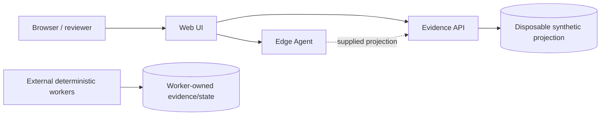

# Architecture overview

The platform keeps evidence authority separate from presentation and inspection.

## Boundaries

- **Evidence API** owns only a disposable synthetic projection store.
- **Edge Agent** classifies supplied projections and always reports mutation authority as false.
- **Web UI** presents artifacts and inspection results.
- **Workers/evidence state** are intentionally outside this runtime and are not implemented or controlled here.
- **Generic deployment intent** under `deploy/kubernetes/base/` describes workload shape only. It carries no provider or account coordinates and grants no deployment authority.

## Browser integration

Local Compose uses explicit loopback backend URLs and an explicit two-origin CORS allowlist. A same-origin deployment can leave Web UI backend values empty so the browser uses relative API paths behind an application gateway.

No cloud runtime, production SLO, persistence layer, or autonomous operational authority is implied.
